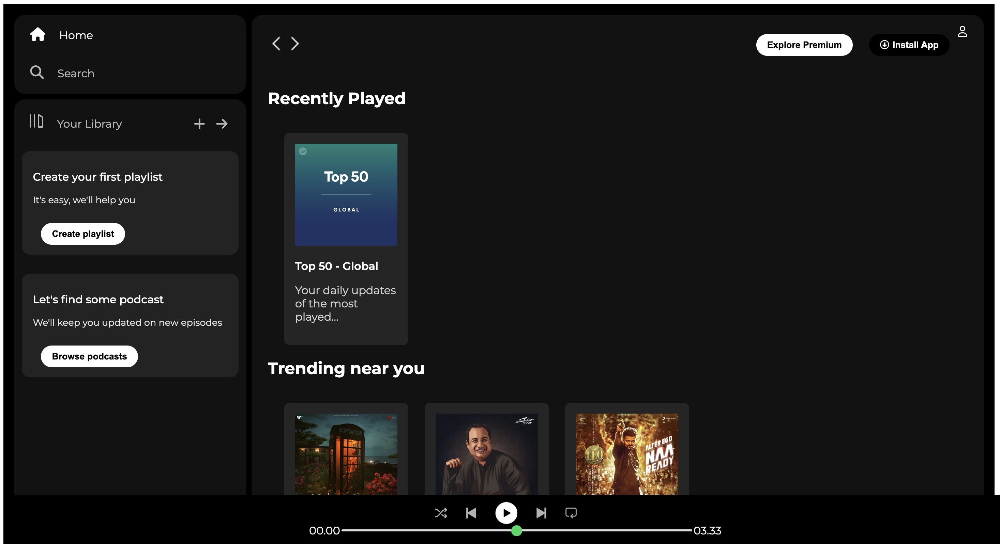
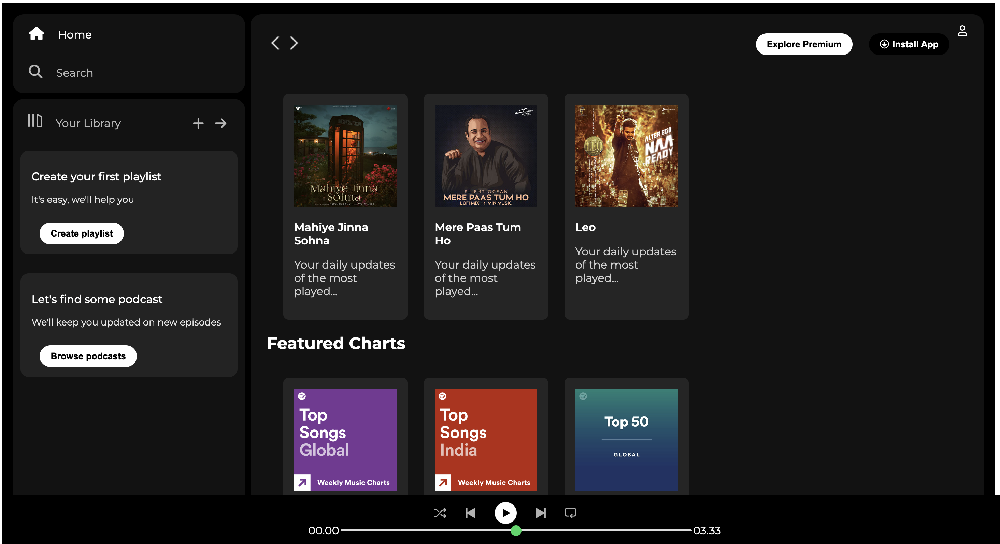
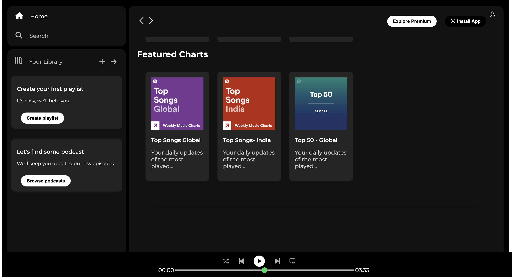

# 🎵 Spotify Clone — Web Player Homepage

A pixel-perfect clone of the **Spotify Web Player** homepage built with pure HTML & CSS.

---

## 📸 Screenshots

### Home — Recently Played


### Trending Near You


### Featured Charts


---

## ✨ Features

- **Sidebar Navigation** — Home & Search links with hover effects
- **Your Library** — Prompt cards for creating playlists and browsing podcasts
- **Sticky Navbar** — Stays at top while scrolling; includes Explore Premium, Install App, and user icon
- **Music Cards Grid** — Recently Played, Trending Near You, and Featured Charts
- **Bottom Music Player** — Fixed player bar with playback controls and a custom green progress bar
- **Responsive Layout** — Forward nav arrow hides on screens below 1000px
- **Google Fonts** — Montserrat typeface throughout
- **Font Awesome 6** — Icons for nav, player controls, and buttons

---

## 🛠️ Tech Stack

| Technology | Usage |
|---|---|
| HTML5 | Structure & semantic markup |
| CSS3 | Flexbox layout, sticky positioning, custom range input |
| Google Fonts | Montserrat typeface |
| Font Awesome 6 | Icons throughout the UI |

---

## 🚀 Getting Started

```bash
git clone https://github.com/PrinceSagwal/Spotify-Clone.git
cd Spotify-Clone
open Index.html
```

---

## 🔮 Future Improvements

- [ ] JavaScript play/pause controls
- [ ] Animated real-time progress bar
- [ ] Hover play overlay on music cards
- [ ] Collapsible sidebar for mobile

---

## 👤 Author

**Prince Sagwal** — [@PrinceSagwal](https://github.com/PrinceSagwal)

---

> ⚠️ Built for learning purposes only. All Spotify trademarks belong to [Spotify AB](https://www.spotify.com).
